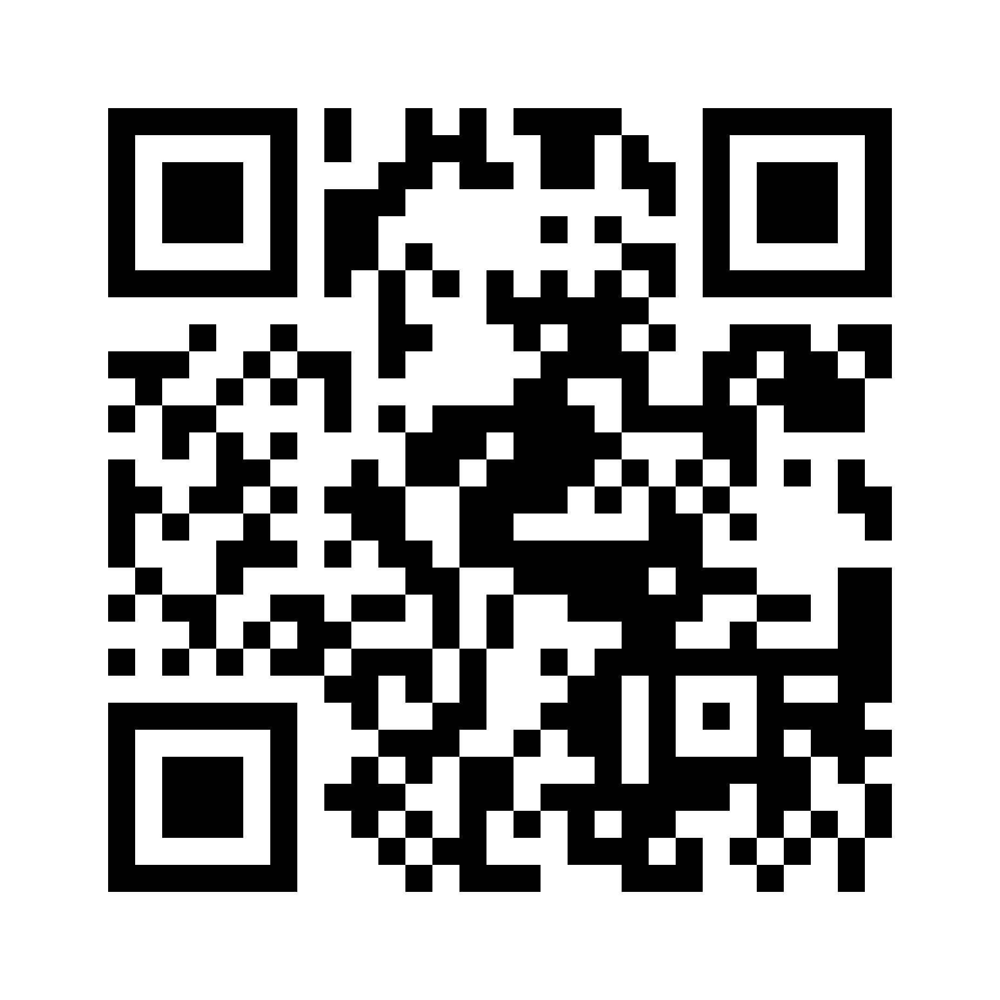

# Lehrmittel
Das Lehrmittel Computertechnik und Programmierung I wird herausgegeben von der Wings Lernmedien AG.

[https://w2y.ch/60d0a](https://w2y.ch/60d0a)

# Cheatsheet
Begleitend zum Lehrmittel ist ein Cheatsheet (Zusammenfassung) verfügbar. In diesem
Cheatsheet werden die wichtigsten Befehle und Zusammenhänge in kompakter Form dargestellt.
  
Den Downloadlink entnehmen Sie dem Ressourcenblatt, welches dem Lehrmittel beiliegt.

# Musterlösungen
Die Musterlösungen zu den Übungen sind als Download verfügbar.  
Wichtig: Benutzen Sie die Musterlösungen zur Kontrolle oder um einen Gedankenanstoss bei einer
Übungsaufgabe zu erhalten. Programmieren lernen erfordert, wie so vieles andere auch, Fleiss und Ausdauer.  

# Vimeo Videokanäle
Lerninhalte aus dem Bereich der Computertechnik und Programmierung werden zunehmend in der Form von   
Videotutorials vermittelt. Diesem Umstand trägt das Lehrmittel in Form von sechs Videokanälen Rechnung,  welche
thematisch geordnete Videos enthalten. Der Aufruf erfolgt entweder über einen Weblink oder über einen QR-Code.
In Abhängigkeit Ihres Computers / Mac ist es sinnvoll, das Video und die PyCharm Lernumgebung auf zwei verschiedenen
Monitoren zu betrachten. Dank dem QR-Code ist der Zugang zu den Videos auch mit mobilen Endgeräten (Smartphone
Tablet) einfach möglich.  
Hinweis: Ev. ist es notwendig eine QR-Code-App auf dem mobilen Endgerät zu installieren.
  
<table style="width:100%">
  <tr>
    <td><h3>Installation</h3>Installation der benötigten Softwaretools für die Betriebssysteme Windows und Mac sowie der Kursumgebung für das Lehrmittel.  <a href="https://w2y.ch/d5n">https://w2y.ch/d5n</a>  </td>
    <td><h3>Struktogramme</h3>Einführung in die Struktogramme und den Struktogrammeditor structorizer.  <a href="https://w2y.ch/1fy">https://w2y.ch/1fy</a>  </td>
    <td><h3>Python Grundlagen</h3>Die Grundlagen der Programmiersprache Python.  <a href="https://w2y.ch/gv9">https://w2y.ch/gv9</a>  </td>
  </tr>
  <tr>   
    <td><h3>micro:bit</h3>Mithilfe von Python wird der Embeddedcomputer micro:bit angesteuert.  <a href="https://w2y.ch/75m">https://w2y.ch/75m</a>  </td>
    <td><h3>PyGame-Projekt</h3>Entwicklung eines Games auf der Basis von PyGame. <a href="https://w2y.ch/pfy">https://w2y.ch/pfy</a>  </td>
    <td><h3>Tipps und Tricks, FAQ</h3>Hinweise und Anleitungen zum Umgang mit dem Lehrmittel und den Softwaretools.  <a href="https://w2y.ch/80d">https://w2y.ch/80d</a>  </td>
  </tr>
</table>

# PyCharm Educational Kurs
Den Downloadlink entnehmen Sie dem Ressourcenblatt, welches dem Lehrmittel beiliegt.

# Firmware micro:bit
Den Downloadlink entnehmen Sie dem Ressourcenblatt, welches dem Lehrmittel beiliegt.

---
Copyright © 2020 Wings Lernmedien AG, alle Rechte vorbehalten.  
Diese Kursunterlagen sind urheberrechtlich geschützt. Die Vervielfältigung und Weitergabe der Texte,
Bilder und aller zusätzlich zur Verfügung gestellten elektronischen Medien, auch auszugsweise, ist ohne
schriftliche Zustimmung der Wings Lernmedien AG urheberrechtswidrig und strafbar.  
Auch Übersetzungen, Mikroverfilmung und Verarbeitung mit elektronischen Systemen sind ohne
ausdrückliche Zustimmung der Wings Lernmedien AG nicht erlaubt.
