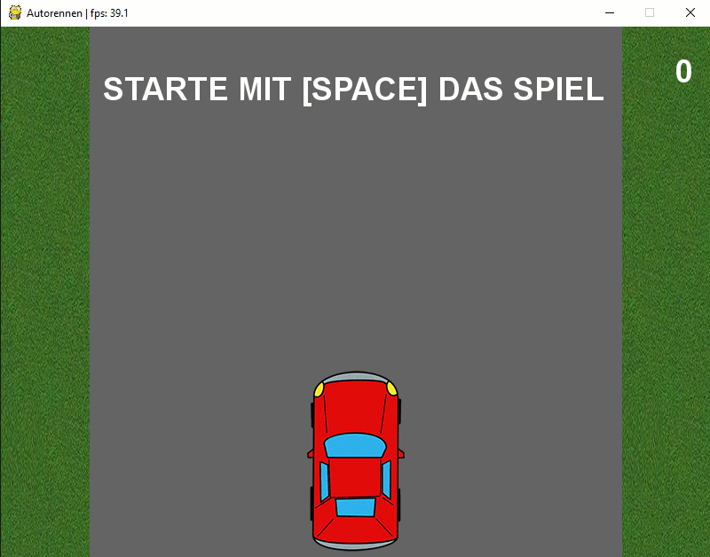

# Autorennen

Im letzten Teil des Kapitels Pygame erstellen wir ein Autorennspiel. Die Umsetzung erfolgt in geführten Teilschritten.
Mit der Umsetzung des Spiels kannst du deine gelernten Programmierkenntnisse an einer konkreten Anwendung einsetzen. 

## Spieldemo

## Spielstrategie
Wir fahren auf einer Rennstrecke, durch gezielte Lenkbewegungen überholen wir andere Fahrzeuge. Für jedes
überholte Fahrzeug erhalten wir einen Punkt. Bein einem Zusammenstoss werden die gesammelten Punkte gelöscht und das
Spiel beginnt von Neuem.

## Teilaufgaben
Die Umsetzung erfolgt in 6 Teilaufgaben. Damit der schrittweise Aufbau in der Umsetzung gewährleistet werden kann,
entspricht die nachfolgende Teilaufgabe jeweils der Lösung der vorhergehenden Teilaufgabe (TA2 ist die Lösung von TA1 usw.).  

- TA1 Hintergrund, eigenes Auto
    - Umsetzung der Oberfläche bestehend aus Strasse und zwei Seitenrändern.
    - Platzierung Auto mit der Möglichkeit fünf Positionen anzusteurn.

- TA2 Überholendes Auto
    - Integration des zu überholenden Autos.
    - Die Positionierung erfolgt mittels Zufallsgenerator auf der ganzen Breite der Fahrbahn (5 Positionen).
    
- TA3 Optimierung Position überholendes Auto
    - Die Positionierung wird eingeschränkt auf drei Positionen.
    - Die Positionierung richtet sich nach der aktuellen Position des eigenen Autos.
    
- TA4 Integration micro:bit
    - Der micro:bit wird in das Spiel integriert.
    - Die Tasten a und b werden mit der Positionsvorgabe des eigenen Autos verbunden.
    
- TA5 Kollisionsdetektion und Zähler
    - Die Kollision zwischen dem eigenen sowie dem überholdenden Fahrzeug wird integriert.
    - Der Zähler der überholten Autos wird integriert.
    - Das Startverhalten des Spiels wird integriert.
    
- TA6 Sound
    - Während der Fahrphase des Spiels wird eine WAV Datei in Dauerschlaufe abgespielt. 
    - Bei einer Kollision wird ein Kollisiongeräusch abgespielt.

- Musterlösung
    - Musterlösung des Spiels mit sämtlichen Funktionen der Teilaufgaben 1-6.
