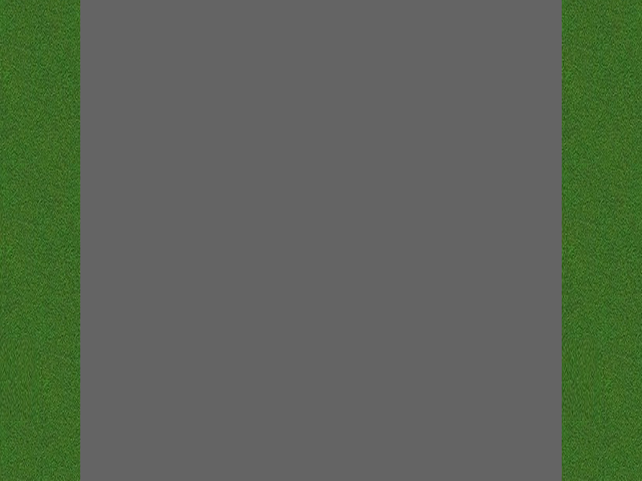

# TA1 Hintergrund und eigenes Auto

Im ersten Schritt wird der Hintergrund, bestehend aus den zwei Seitenstreifen und der 
Strasse, erstellt. Anschliessend wird das eigene Auto am unteren Rand platziert und
mit den Pfeiltasten links und rechts verknüpft.  

Die nachfolgende Anleitung soll dir helfen, die Umsetzung schrittweise durchführen zu können:

1. Definition der Leinwand: 
    - Breite 800 Pixel
    - Höhe 600 Pixel
    - Bildwiederholrate 40 fps.
    - Hintergrundfarbe (Strasse) Grau, RGB-Farbwert (100, 100, 100)
    
     
     
2. Seitenränder
    - Die Bilddatei `img/grass_boundary_100_600.png` wird an der linken und rechten Seite  
      eingefügt. Das Bild ist 100 Pixel breit und 600 Pixel hoch.
      
     

3. Eigenes Auto
    - Die Bilddatei `img/car_skin_120_210.png` wird unten zentriert eingefügt.  
      eingefügt. Das Bild ist 120 Pixel breit und 210 Pixel hoch.
      In der Höhe sind 5 Pixel vom unteren Rand freizulassen.
      
     
    
4. Das eigene Auto ist in der Lage 5 Positionen auf der Strasse einzunehmen. Die
   Positionen werden mit -2, -1, 0, 1, 2 bezeichnet. Die Position 0 entspricht dabei der
   Zentrierung in der Mitte des Bildschirms.
   - Hinweis 1: Zentrierung `car_x_centre = int(canvas_width / 2 - car_width / 2)`
   - Hinweis 2: Positionierung x `my_car_x = my_car_position_x * car_width + car_x_centre`
   - Hinweis 3: Positionierung y `my_car_y = canvas_height - car_heigth - 5`
    
5. Das Positionierung des Autos soll mit den Pfeiltasten links und rechts bewegt werden können.
    - Hinweis: Benutze die Tastaturevents `pygame.KEYDOWN`, `pygame.K_LEFT`, `pygame.K_RIGHT`  

     
