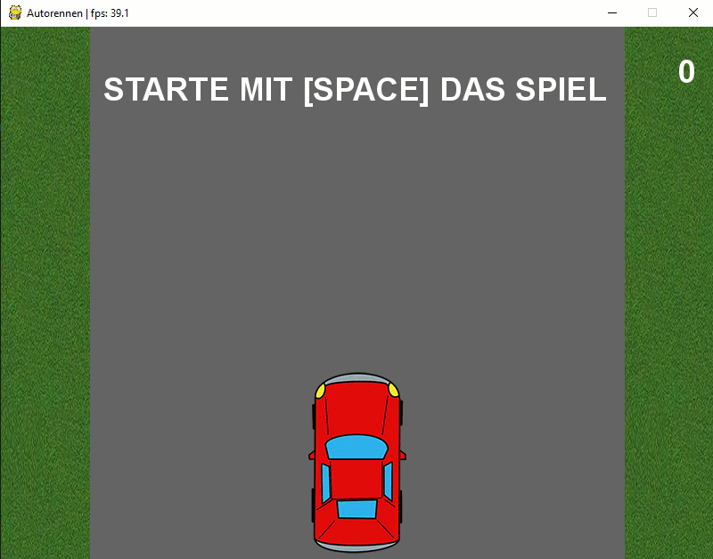

# TA5 Kollisionsdetektion und Zähler

In dieser Teilaufgabe wird die Kollisionsdetektion sowie der Zähler für die erfolgreich überholten Fahrzeuge integriert.

Die nachfolgende Anleitung soll dir helfen, die Umsetzung schrittweise durchführen zu können:

1. Kollisionsdetektion
    - Eine Kollision liegt vor, wenn die x Positionen des eigenen sowie des zu überholenden Fahrzeuges gleich sind und
      die y Position des zu überholenden Fahrzeuges grösser gleich derjenigen des eigenen Fahrzeuges ist.
      Eine mögliche Umsetzung könnte aussehen:  
      `car_crash = (my_car_position_x == car_position_x) and (car_y >= (my_car_y - car_heigth))`
      
2.  Punktezähler
    - Definiere eine neue Variable `score` für die Erfassung des Punktestandes.
    - Der Punktestand wird erhöht, sobald sich das zu überholende Auto ausserhalb des sichtbaren Bereichs
      der Anzeige befindet.
    - Visualisiere den aktuellen Stand des Spiels auf der rechten oberen Seite.  
      Für die Anzeige von Text kopierst du am besten die Funktion `draw_text` von einer vorhergehenden Übung.
      
3.  Freigabe des Spiels
    - Definiere eine neue Variable `car_drive_enable` welche die Freigabe für das zu überholende Auto erteilt.
    - Falls die Freigabe `False` ist, wird der Text `STARTE MIT [SPACE] DAS SPIEL` angezeigt.
    

      

