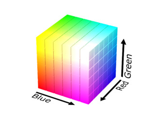

# Pygame
[pygame.org](https://www.pygame.org)  
[Onlinehilfe Pygame](https://www.pygame.org/docs/)

<!---->

Pygame erstellt einen einfachen plattformübergreifenden Zugang zur SDL (Simple DirectMedia Layer)
Entwicklungsbibliothek. Das Ziel besteht darin, grafische Programme erstellen zu können, ohne dabei die Details der
jeweiligen Zielplattform zu betrachten. Das Pythonmodul Pygame bietet eine Schnittstelle
in der Form einer Hochsprache zur in der Programmiersprache C entwickelten SDL-Bibliothek.

## Programmstruktur
Pygame basiert auf einer zyklischen Programmstruktur. Das bedeutet, dass die Abarbeitung im Bereiche der
Verarbeitung steht in der gleichen Reihenfolge Eventhandling, Spiellogik und Update des Displays erfolgt. 
Die einzelnen Schritte in der Umsetzung von Pygame-Programmen
lassen sich wie folgt unterteilen:

- Import der Bibliotheken: Die benötigten Python-Bibliotheken werden am Anfang des Programmes importiert.
- Initialisierung: Pygame, Variablen, Farben sowie weitere Elemente werden initialisiert.
- Zyklisches Hauptprogramm: Kontinuierliche Bearbeitung.
    - Eventhandling: Erfassung der Eingabeereignisse (Tastatur, Maus, Joystick …)
    - Spiellogik: Die Logik des Spiels.
    - Update: Aktualisierung der Ausgabegeräte (Display, micro:bit, …).


## Farbedefinitionen
Farben werden in Pygame in der Form von einem Tupel, bestehend aus drei Bytes in der Reihenfolge RGB beschrieben. Die drei Farbwerte R Rot, G Grün und B Blau
werden anteilsmässig addiert. Bei dieser sogenannten additiven Farbmischung entspricht die vollständige Mischung der drei Farbkanäle der Farbe Weiss.

````python
#            R    G    B
WHITE =     (255, 255, 255)
BLACK =     (0,     0,   0)
GRAY =      (100, 100, 100)
RED =       (255,   0,   0)
GREEN =     (  0, 255,   0)
BLUE =      (  0,   0, 255)
```` 
Hinweis: Da die Syntax von Python keine Konstanten kennt, werden konstante Werte oft gross geschrieben.

## Display
[Onlinehilfe Display](https://www.pygame.org/docs/ref/display.html)  
Mit dem Modul Display lässt sich die Anzeige beeinflussen. 

## Eventhandling
[Onlinehilfe Eventhandling](https://www.pygame.org/docs/ref/event.html)  
Das Eventhandling erfasst die Ereignisse zwischen zwei Aufrufen von `pygame.event.get()`.


