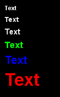

# Text
[Onlinehilfe Pygame Font](https://www.pygame.org/docs/ref/font.html)

Beim Zeichnen von Text auf die Leinwand ist ein dreiteiliger Ablauf notwendig. 
1. Die Verlinkung zum Font (Zeichensatz) wird erstellt.
2. Der Text wird gerendert.
3. Der gerenderte Text wird auf dem Display angezeigt.

Um den Umgang mit Texten zu vereinfachen, wird empfohlen die Funktion `draw_text` zu 
verwenden.

````python
def draw_text(display=None, xy=(0, 0), text='', colour=(255, 0, 0), size=16):
    """Funktion für das Zeichnen von Text auf die Pygame Leinwand."""
    font = pygame.font.SysFont(name="arial", size=size, bold=1)
    render_text = font.render(text, True, colour)
    display.blit(render_text, xy)
```` 


