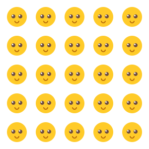

# Übung Zeichnungsobjekte 1

Erstelle ein Programm, in welchem auf einer Leinwand mit den Abmassen 300 x 300 Pixel symmetrisch verteilt
25 Smileys gezeichnet werden.  
Als Basisbild kanns du die Datei `img/smiley_48_48.png` verwenden. 

    Benutze eine doppelte for Schlaufe.

