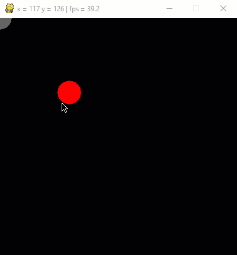

# Übung Mausauswertung 1

Erstelle ein Programm, in welchem ein roter Kreis dem Mauszeiger folgt.
Nach einem Mausklick wird an den Mauskoordinaten, zum Zeitpunkt des Klicks, ein grauer Kreis gezeichnet.

GIF-Animation 

    

