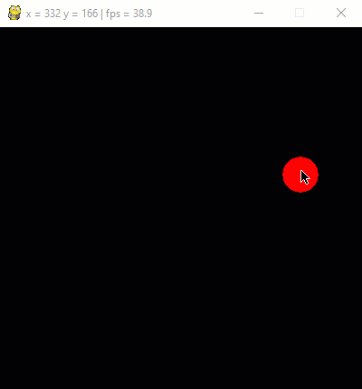

# Übung Mausauswertung 2

Erstelle ein Programm, in welchem ein roter Kreis dem Mauszeiger folgt.
Nach einem Mausklick wird an den Mauskoordinaten, zum Zeitpunkt des Klicks, ein grauer Kreis gezeichnet.
Als Erweiterung der Übung 1 wird nicht nur der letzte Mausklick erfasst, sondern es werden sämtliche 
Clicks erfasst und angezeigt.

GIF-Animation 

    

