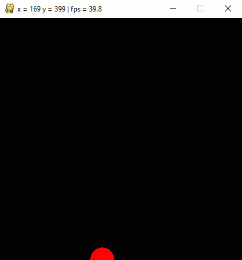

# Übung Mausauswertung 3

Erstelle ein Programm, in welchem ein roter Kreis dem Mauszeiger folgt.
Nach einem Mausklick wird an den Mauskoordinaten, zum Zeitpunkt des Klicks, ein grauer Kreis gezeichnet.
Als Erweiterung der Übung 1 wird nicht nur der letzte Mausklick erfasst, sondern es werden sämtliche 
Clicks erfasst und angezeigt. Im weiteren ist die Mausspur mit einem blauen Strich zu markieren.

GIF-Animation 

    

    Die blaue Spur kann als Ansammlung von Kreisen betrachtet werden. Die Koordinaten lassen sich 
    aus dem `MOUSEMOTION` Event ableiten.

