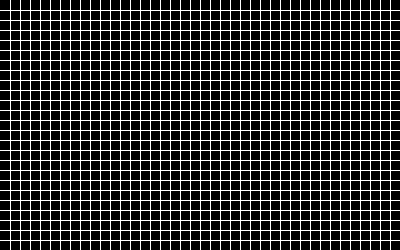

# Übung Zeichnungsobjekte 1

Erstelle ein Programm, in welchem alle 10 Pixel eine Linie mit der Breite von einem Pixel gezeichnet wird.
Die Umsetzung soll sich dynamisch an der Breite und Höhe des Displays anpassen.

    Benutze eine for Schlaufe <code>for i in range(10, canvas_width, 10)</code>.

