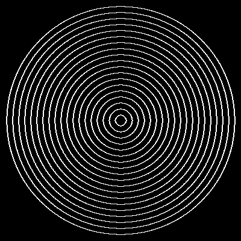

# Übung Zeichnungsobjekte 1

Erstelle ein Programm, in welchem vom Zentrum ausgehend Kreise mit einem Abstand von 10 Pixeln gezeichnet werden.
Die Umsetzung soll sich dynamisch an der kürzeren Seite der Breite oder Höhe des Displays anpassen.

    Benutze eine for Schlaufe <code>for r in range(10, int(canvas_pixel / 2), 10)</code>.

