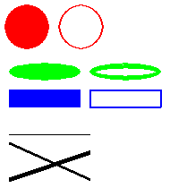

# Zeichnungsobjekte
[Onlinehilfe Pygame Zeichnungsobjekte](https://www.pygame.org/docs/ref/draw.html)

Pygame stellt die wichtigsten Zeichenobjekte in Form von Funktionsaufrufen zur Verfügung.

Die vier wichtigsten Zeichnungsobjekte weisen die folgenden Schnittstellen auf:
````python
pygame.draw.line(display, colour, (start_x, start_y), (stop_x, stop_y), border)  # Linie
pygame.draw.circle(display, RED, (center_x, center_y), radius, border)  # Kreis
pygame.draw.ellipse(display, GREEN, (start_x, start_y, width, height), border)  # Ellipse
pygame.draw.rect(display, BLUE, (start_x, start_y, width, height), border)  # Rechteck
```` 
Zu beachten ist der Parameter `border`: Bei einer Zuweisung mit dem Wert 0
wird die Form ausgefüllt gezeichnet. Bei einer Zuweisung >0, entspricht dies der Breite der Linie.


