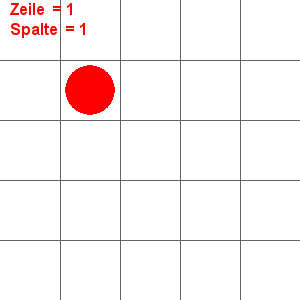

# Beispiel Pygame und micro:bit

Exemplarisches Beispiel, wie der micro:bit in Pygame eingebunden werden kann.
Zu beachten ist die Unterscheidung der Zeilen- und Spaltensteuerung mittels Auswertung
des Beschleunigungssensors.

