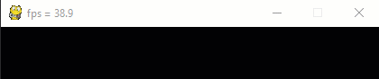

# Übung Pygame und micro:bit
Erstelle ein Programm, in welchem der micro:bit in Pygame eingebunden wird.
Auf dem Display wird mittels Text angezeigt, welche Taste(n) des micro:bit betätigt ist/sind.

GIF-Animation 

    

