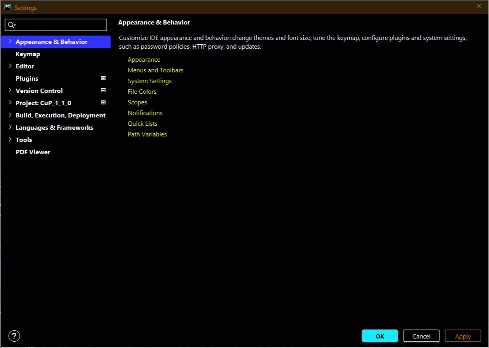

# Schreibe ein Pythonprogramm

Python ist eine einfach zu lernende, aber mächtige Programmiersprache. 
Durch die elegante und schlanke Syntax und die dynamische Typisierung 
ist der Pythoninterpreter sowohl für einfache Skripte als auch für komplexe
und rechenintensive Aufgaben gut geeignet. 

Für den Aufruf von Pythonskripten (*.py - Dateien) bzw. Pythonbefehlen stehen
unterschiedliche Möglichkeiten zur Verfügung:
- via Terminalfenster
- indirekt über Batch oder Shellskripte
- aus einer integrierten Entwicklungsumgebung heraus

In diesem Kurs fokusieren wir auf den Aufruf aus der PyCharm (Educational) Entwicklungsumgebung.

Um das Skript task.py auszuführen, sind in PyCharm (Educational) verschiedene Möglichkeiten 
integriert:
- Die Maus ist im Codefeld. Aufruf des Pythoninterpreters mit rechter Maustaste Run 'task'
- Click auf den Button Check
- Direkter Aufruf via Tastaturkürzel
    * Menue File, Settings, Keymap, Run context configuration, Taste F10 oder eigene Auswahl
    * Test der Konfiguration: Click in das Codefeld, Taste F10 oder eigene Auswahl

GIF-Animation Einstellungen Tastaturkürzel

    

