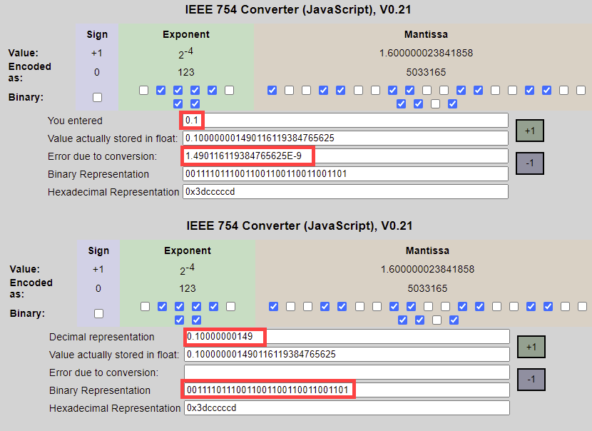

# Ganze und Fliesskommazahlen

In Python sind zwei numerische Datentypen eingebetet:

- integer => ganze Zahlen
- float => Fliesskommazahlen

Hinweis: Als dritter Zahlentyp können die komplexen Zahlen hinzugefügt werden.

## Integer (Ganze Zahlen)
Ein Integer ist eine ganze Zahl ohne Kommastellen. Somit ist die Zahl 42 ein Integer, die Zahl
0.42 aber nicht. Im Umgang mit dem Pythonintergreter werden Integerzahlen mit dem Kürzel int repräsentiert.
Die Pythonfunktion `type(42)` dient dazu, den Datentyp einer Zahl (allgemeiner eines Objekts) zu ermitteln.

Die Umwandlung von einem Stringliteral in einen Integer erfolgt mittels `int("42")`.

## Float (Fliesskommazahlen)
Eine Fliesskommazahl (float) ist eine Zahl mit einem Kommazeichen (bzw. einem Punkt). Die Notation erfolgt entweder durch 
direkte Eingabe des Zahlenwertes, oder durch die Exponentialnotation. Die Exponentialnoation ist insbesondere
bei sehr grossen oder sehr kleinen Zahlen hilfreich.

## IEEE754 oder warum der Computer nicht genau rechnen kann
Im Computer werden ganze und Fliesskommazahlen in der Form einer endlichen Serie von 0 und 1 gespeichert. 
Die Anzahl dieser Serie ist beschränkt (üblicherweise 64) und somit endlich. Diese Beschränktheit
des Zahlenraumes ist in den meisten Berechnungen nicht bemerkbar. 

Weitere Informationen findest du unter: 

- https://docs.python.org/3/tutorial/floatingpoint.html
- https://www.h-schmidt.net/FloatConverter/IEEE754de.html  

Ein exemplarisches Beispiel der Beschränktheit soll dies veranschaulichen:  
Der mathematische Ausdruck: `(0.1 + 0.1 + 0.1) = 0.3` kann als wahre Aussage betrachtet werden.  
Die Umsetzung mit Python lautet: `print((0.1 + 0.1 + 0.1) == 0.3)` und liefert `False`!
Im Hintergrund werden Zahlen nach der Norm IEEE754 codiert. Mit der Beschränktheit des Zahlenraumes entstehen
zwangsläufig Ungenauigkeiten bei der Umrechnung.  

### wie weiter?
Das obige Beispiel zeigt die Beschränktheit des Computers auf. Dies soll aber nicht bedeuten, dass mit einem
Computer nicht gerechnet werden kann. Bei den allermeisten Opterationen liefert der Computer korrekte bzw. 
Resultate mit einer Ungenauigkeit welche die Aufgabenstellung nicht beeinflusst. Trotzdem sollte jede 
Berechnung kritisch hinterfragt werden ob das gelieferte Resultat der Erwartungshaltung entspricht.