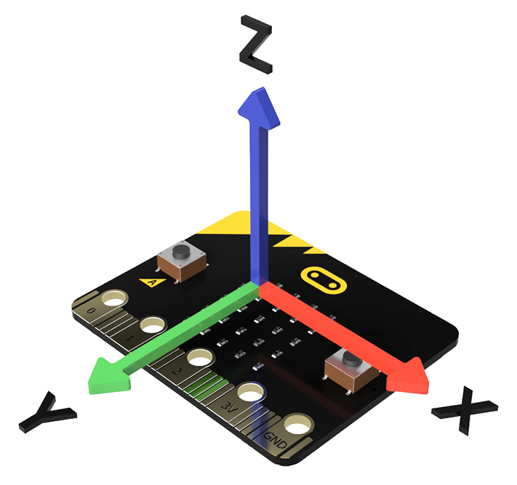

# Beschleunigunssensor, Beispiel 1

In Abhängigkeit der Beschleunigung auf der x Achse wird in
fünf Stufen das mittlere LED-Band von links nach rechts angesteuert.

 

In dieser Umsetzung werden die Leuchtdioden direkt in der entsprechenden Fallunterscheidung angesteuert.

 

GIF-Animation siehe Hinweis

    

