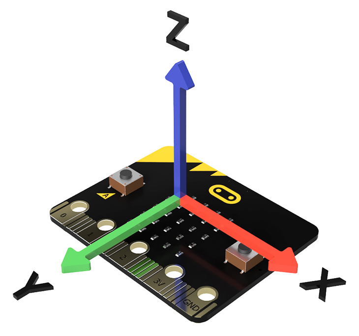
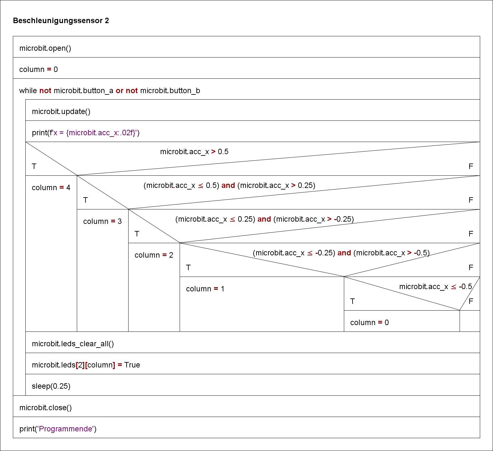

# Beschleunigunssensor, Beispiel 2

In Abhängigkeit der Beschleunigung auf der x Achse wird in
fünf Stufen das mittlere LED Band von links nach rechts angesteuert.

 

In dieser Umsetzung werden die Leuchtdioden ausserhalb der Fallunterscheidung gesetzt.

 

GIF-Animation siehe Hint

    

