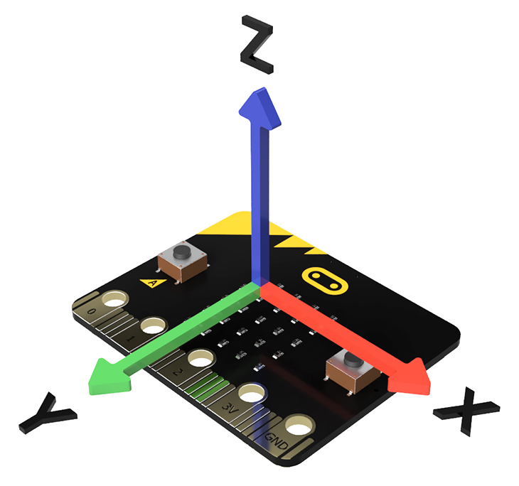
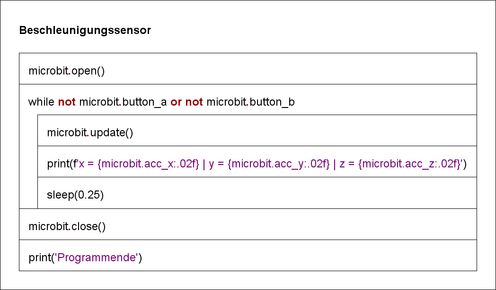

# Beschleunigungssensor

Ein Beschleunigungssensor erfasst zum einen die Fallbeschleunigung, zum anderen die äusseren Einwirkungen.
Beim Micro:bit erfolgt die Erfassung der Beschleunigung durch einen [MMA8653FC](https://www.nxp.com/products/sensors/motion-sensors/3-axis/2g-4g-8g-low-g-10-bit-digital-accelerometer:MMA8653FC)
Sensor von NXP.  
Durch Messung der Beschleunigung (Vibrationen) im Zeitbereich mit anschliessender Transformation in den Frequenzbereich (Fouriertransformation), 
kann eine Aussage über die Frequenzanteile der Vibration gemacht werden [Vibration Sensing and Monitoring - Demo](https://www.nxp.com/video/vibration-sensing-and-monitoring-demo:FTF14_VIBRATIONSENS_VID).
Diese Art der Signalbetrachtung ist im Bereiche der technisch wissenschaftlichen Arbeit mit Maschinensystemen
von elementarer Bedeutung. 

 

In diesem Kurs interessieren wir uns für die Beschleunigung als Verhältniszahl zur Fallsbeschleunigung $g$.
Je nach Richtung, in welcher der Micro:bit sich bewegt, wird bei vibrationsfreier Umgebung ein Zahlenwert
zwischen $-1$ und $+1$ angezeigt. Dies entspricht der Skalierung von $-g = -9.81 \frac{m}{s^2}$ und $g = 9.81 \frac{m}{s^2}$.
Die Zuordnung der Achsen kann dem nachfolgenden Bild entnommen werden.

Das Struktogramm visualisiert den Programmaufbau:

 

    Das Programm wird durch Betätigung der linken oder rechten Taste beendet!

