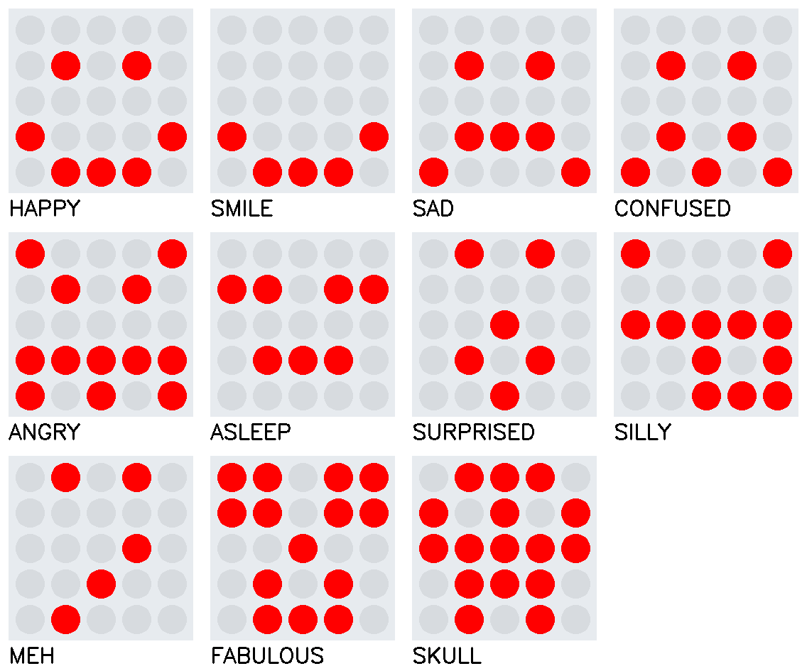
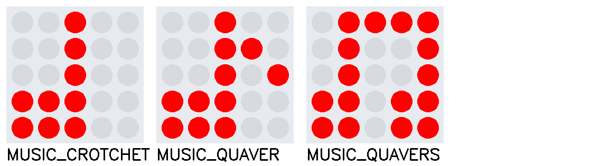

# LED Bilder 1: Einleitung

Auf dem Microbit sind 25 rote Leuchtdioden als 5 x 5 Matrix vorhanden. Die Ansteuerung der Leuchtdioden kann
auf zwei möglichen Arten erfolgen:
1. Ansteuerung der 25 Leuchtdioden über vorgefertigte Bilder welche im Pyhtonmodul fix hinterlegt sind.
2. Jede LED wird einzeln über einen Algorithmus angesteuert.

Die ersten Übungen erfolgen nach der Variante 1. Die Variante 2, in der jede Leuchtdiode einzeln 
angesteuert werden muss, folgt später.

 

## Übersicht der vorhandenen LED-Bilder

Im Kommunikationsmodul des Microbit ([microbit-wings](https://pypi.org/project/microbit-wings/)) ist eine grosse
Anzahl an vorgefertigten Bildern bereits integriert. Damit die Übersicht nicht verloren geht, sind im Cheatsheet
(Zusammenfassung) zum Lehrmittel sämtliche Bilder aufgelistet. Der Zugang zu dieser Zusammenfassung wird im 
Begleitblatt, welches dem Lehrmittel beigelegt ist, aufgezeigt.

Die im Pythonmodul zum micro:bit integrierten Bilder sind nachfolgend aufgelistet:

**Ja Nein**
 
**Gesichter**
 
**Figuren**
 
**Pfeile**
 
**Nummern**
 
**Musik**
 
**Tiere**
 
**Verschiedenes**
 

