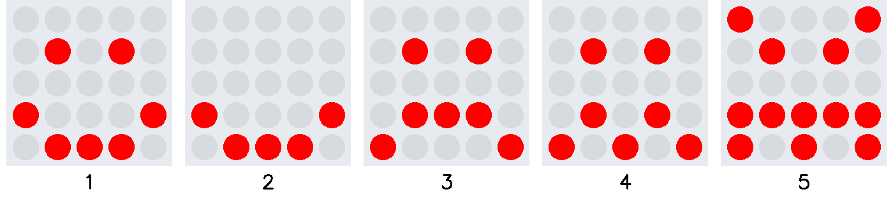
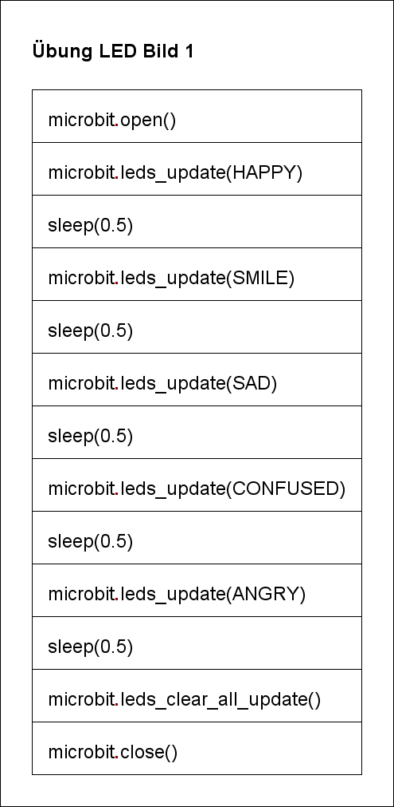
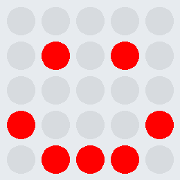

# Übung LED Bild 1

Programmiere fünf aufeineinderfolgende Bilder. Zwischen den Bildwechseln ist jeweils eine Pause
von 0.5 s einzuhalten.
Die Reihenfolge der Bilder lautet: HAPPY, SMILE, SAD, CONFUSED, ANGRY. 

Das Struktogramm zeigt dir einen Lösungsansatz:
  

     

