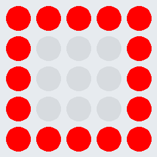

# Übung LED Bild 2

Die zwei Bilder SQUARE und SQUARE_SMALL sollen 6 x alternierend angezeigt werden.
Zwischen den Bildern soll jeweils eine Pause von 0.25 eingehalten werden.
Versuche mithilfe einer Schleife die Aufgabenstellung umzusetzen.

Das Struktogramm zeigt dir einen Lösungsansatz:
  

     

