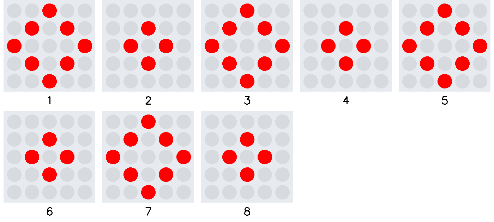
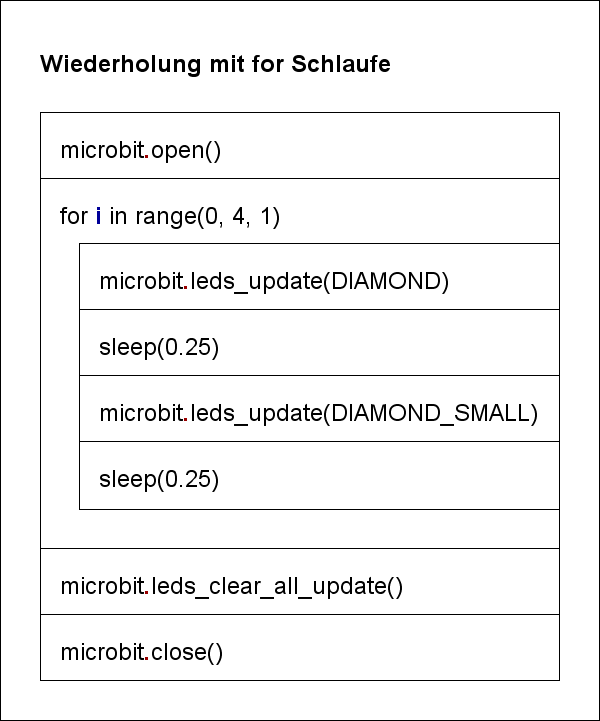
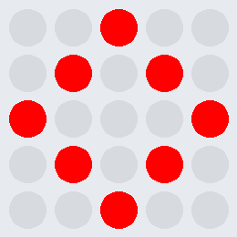

# Wiederholung (for Schlaufe)

Um eine bestimmte Anzahl Wiederholungen auszuführen, ist die `for` Schlaufe am besten geeignet.
Die `range(start, stopp, inkrement)` Funktion definiert im Kopf der Schleife die Anzahl der
Schleifendurchgänge.  
Der Befehl `microbit.leds_clear_all_update()` löscht am Ende die LED Matrix.

Das Struktogramm visualisiert den Algorithmus:

 

     

