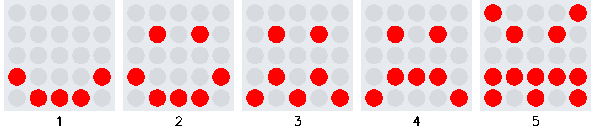
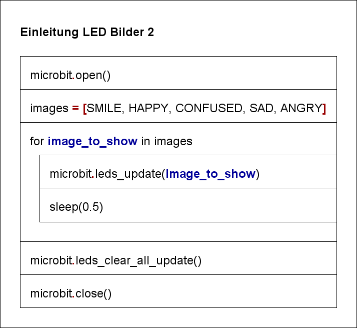

# LED Bilder 2: Einleitung
Listen stellen wie Strings eine sequentielle Anordnung dar. Während Zeichenketten als Sequenz von einzelnen
aufgebaut sind, bestehen die Listen aus einer Sequenz von beliebigen Objekten. In diesem Kapitel betrachten
wir nur Listen mit Sequenzen vom gleichen Datentyp.  
Ein grosser Vorteil bei der Umsetzung von Aufgabenstellungen im Zusammenhang mit Listen besteht darin, dass
die Iteration über die einzelnen Objekte in der Listen sehr einfach mit einer `for` Schlaufe realisiert werden kann.  

Beispiel 1:
```python
for i in range(0, len(images), 1):
    microbit.leds_update(images[i])
    ...
``` 
Im ersten Beispiel extrahiert der `in` Operator aus der Liste, welche mit `range` gebildet wurde, eine Zahl
im Bereich der Listengrösse. Durch Indexierung der Listenposition erfolgt der Datenbezug für die LED-Matrixdarstellung.

Beispiel 2:
```python
for image_to_show in images:  # iteriere über jedes Listenelement
    microbit.leds_update(image_to_show)
    ...
``` 
Im zweiten Beispiel extrahiert der `in` Operator der `for` Schlaufe das LED-Bild aus der Liste mit den LED-Bildern.
Wie im Codebeispiel ersichtlich, führen beide Umsetzungsstrategien zum gleichen Resultat. Die im Beispiel 2 aufgezeigte
Variante ist zum einen einfacher zu verstehen, zum anderen entspricht dies dem Pythonparadigma der einfachen
Lesbarkeit von Quellcode ([the four Python programming styles](https://blog.newrelic.com/engineering/python-programming-styles/)).



Das Struktogramm visualisiert den Algorithmus:

<br>

<div class='hint'>
    <br>
</div>
-
