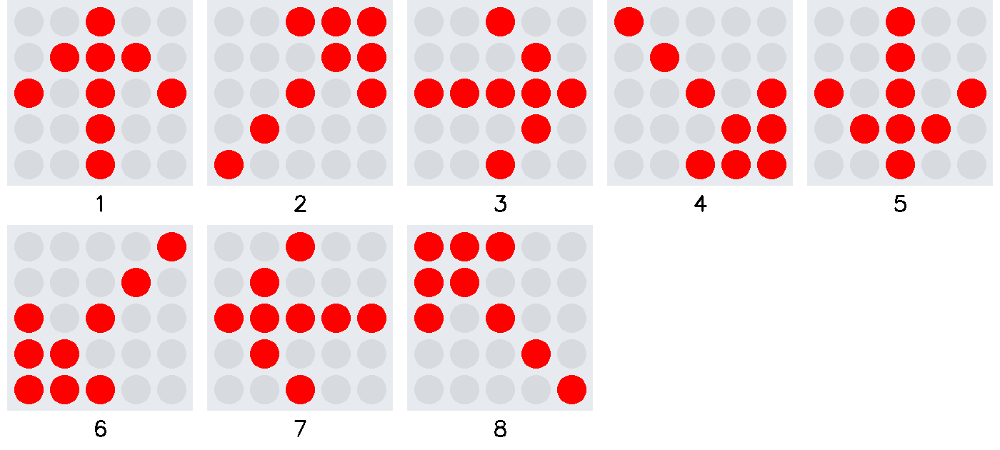
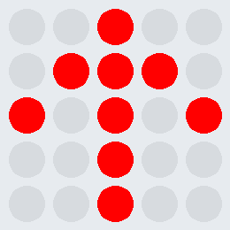

# Übung Ziffern

Erstelle ein Programm, welches die acht die acht Pfeile der Bildersammlung zum Microbit anzeigt.
Die Reihenfolge verläuft im Uhrzeigersinn, beginnend mit der Pfeilrichtung Norden.
 
Der zeitliche Abstand zwischen den Pfeilen beträgt 0.5 s.

Erstelle vor der Umsetzung ein Struktogramm.

     

