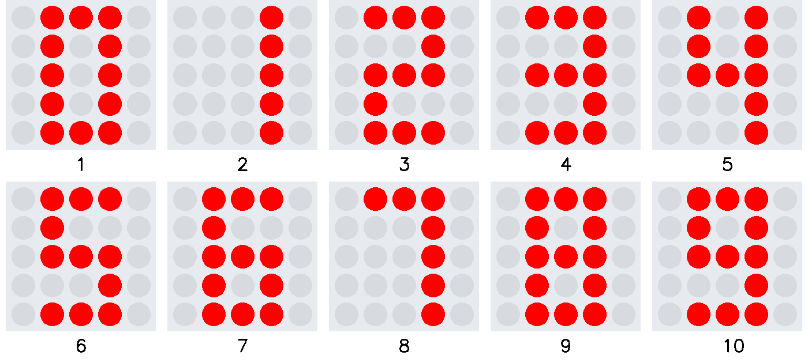
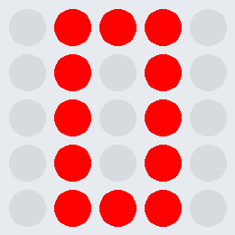

# Übung Ziffern

Erstelle ein Programm, welches die zehn Ziffern 0-9 aufsteigend auf dem Microbit anzeigt.
Der zeitliche Abstand zwischen den Ziffern beträgt 0.5 s.

Erstelle vor der Umsetzung ein Struktogramm.

     

