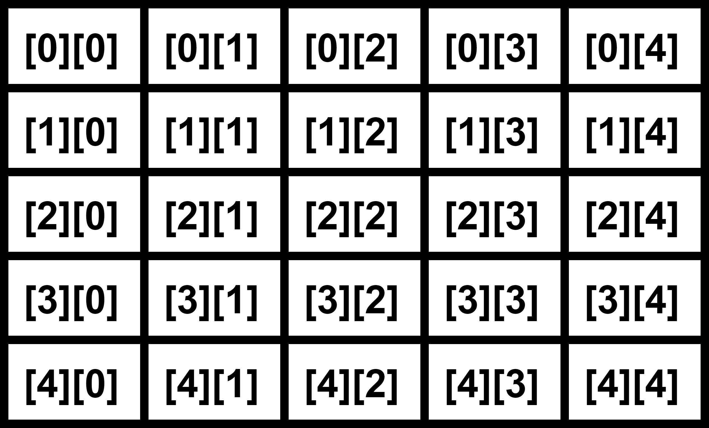
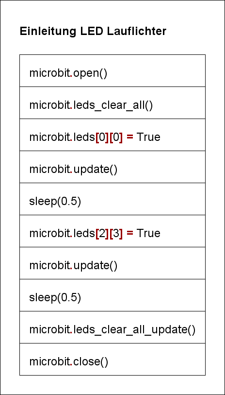
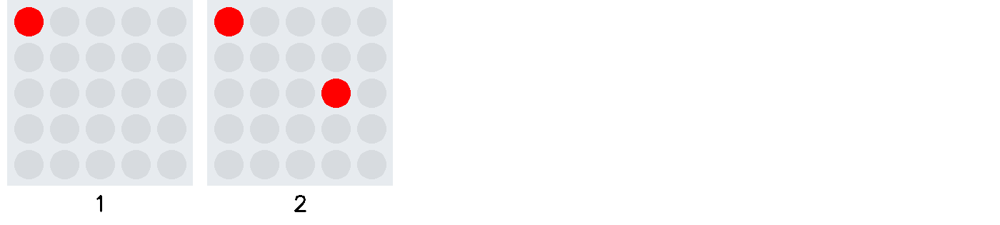

# Lauflichter: Einleitung

Bei der direkten Ansteuerung der 25 LEDs wird eine anderer Mechanismus verwendet. 
Die Leuchtdioden sind in 5 Zeilen zu jeweils 5 Spalten aufgebaut. Damit nicht jede Leuchtdiode mit einer
separaten Variable angesprochen werden muss, wird die zweidimensionale Listenvariable `microbit.leds` 
verwendet.  

In der ersten Dimension ist die Zeile, in der zweiten Dimension die Spalte anzugeben.
Die Anstuerung der Leuchtdiode in der zweiten Zeile, dritten Spalte lautet somit:
`microbit.leds[2][3] = True`  
mit `True` oder `False` wird die Leuchtdiode angesteuert oder gelöscht.

 

## Zweidimensionale Listen

Das zweidimensionale Listenfeld besteht aus zwei Listen. Die erste Liste beinhaltet die fünf
Leuchtdioden der jeweiligen Zeile. Die Zeile wiederum besteht aus einer Liste mit fünf Einträgen, also je einem
Eintrag pro Leuchtdiode.
Mit dem Befehl `row = microbit.leds[1]` wird die zweite Zeile als Liste ausgelesen. Mit
`led_value = row[3]` wird das vierte Element der Liste betrachtet. Diese beiden Befehle können auch
zusammengefasst werden zu `led_value = microbit.leds[1][3]` 

## Democode

Das Struktogramm zeigt den Programmablauf zur Ansteuerung der beiden Leuchtdioden.

   

Die Sequenzdarstellung zeigt den Zustand der Leuchtdioden in den einzelnen Teilschritten.
 
  

Die Animation wandelt die Sequenzdarstellung in eine Animation um.

