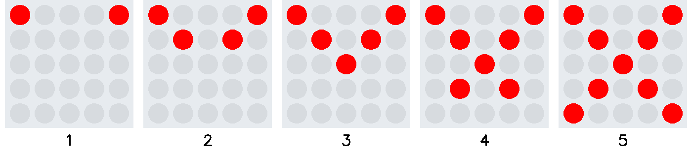

# Übung Lauflicht 1a

Programmiere die zwei Diagnonalen von oben links nach unten rechts sowie die Spiegelung
auf der Vertikalen. Die Diagnonale wird schrittweise aufgebaut mit Pausen von 0.5 s.

Erstelle vor der Umsetzung ein Struktogramm.

     

