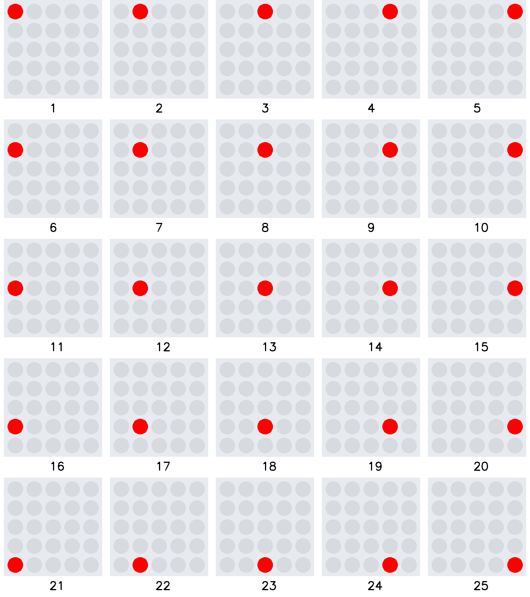

# Übung Lauflicht 2a

Programmiere ein Lauflicht, welches oben links startet und unten rechts endet.
Die Reihenfolge der Leuchtdioden ist der Ablauffolge zu entnehmen.

Erstelle vor der Umsetzung ein Struktogramm.

Hinweis: Benutze zwei verschachtelte for Schleifen

     

