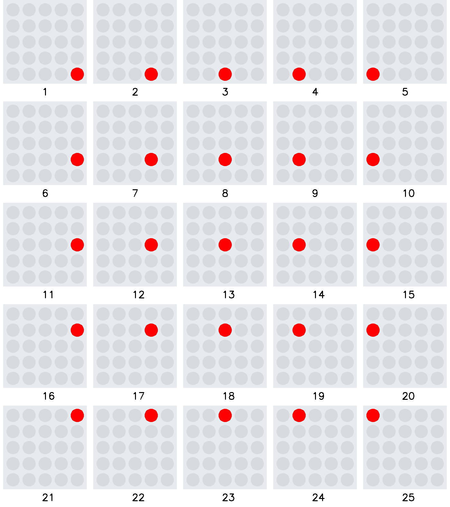

# Übung Lauflicht 2c

Programmiere ein Lauflicht, welches unten rechts startet und oben links endet.
Die Reihenfolge der Leuchtdioden ist der Ablauffolge zu entnehmen.

Erstelle vor der Umsetzung ein Struktogramm.

Hinweis: Benutze zwei verschachtelte for Schleifen

     

