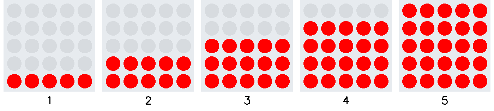
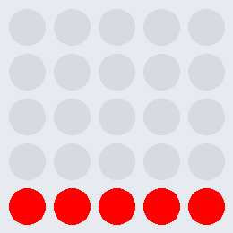

# Übung Lauflicht 3b

Programmiere ein Lauflicht, welches einen Rolladeneffekt von unten nach oben erzeugt.
Die Reihenfolge der Leuchtdioden ist der Ablauffolge zu entnehmen.

Erstelle vor der Umsetzung ein Struktogramm.

     

