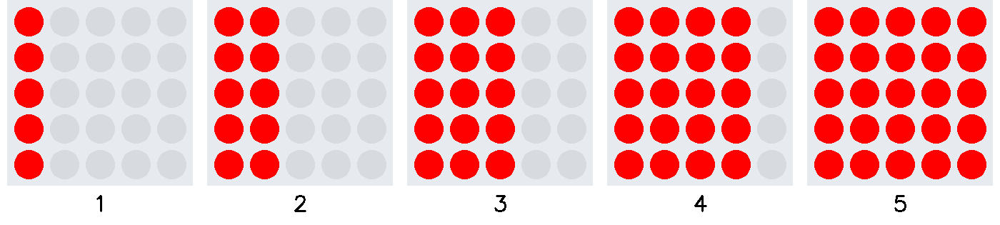
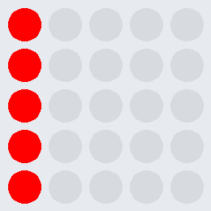

# Übung Lauflicht 3c

Programmiere ein Lauflicht, welches einen Rolladeneffekt von links nach rechts erzeugt.
Die Reihenfolge der Leuchtdioden ist der Ablauffolge zu entnehmen.

Erstelle vor der Umsetzung ein Struktogramm.

     

