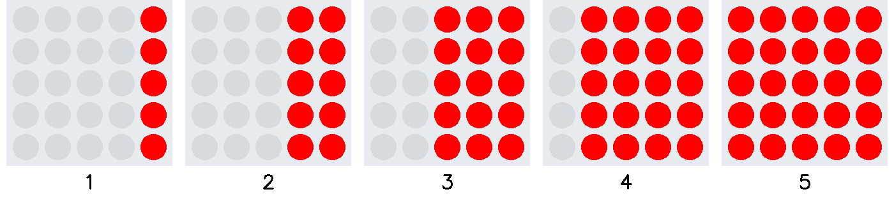
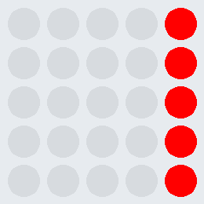

# Übung Lauflicht 3d

Programmiere ein Lauflicht, welches einen Rolladeneffekt von rechts nach links erzeugt.
Die Reihenfolge der Leuchtdioden ist der Ablauffolge zu entnehmen.

Erstelle vor der Umsetzung ein Struktogramm.

     

