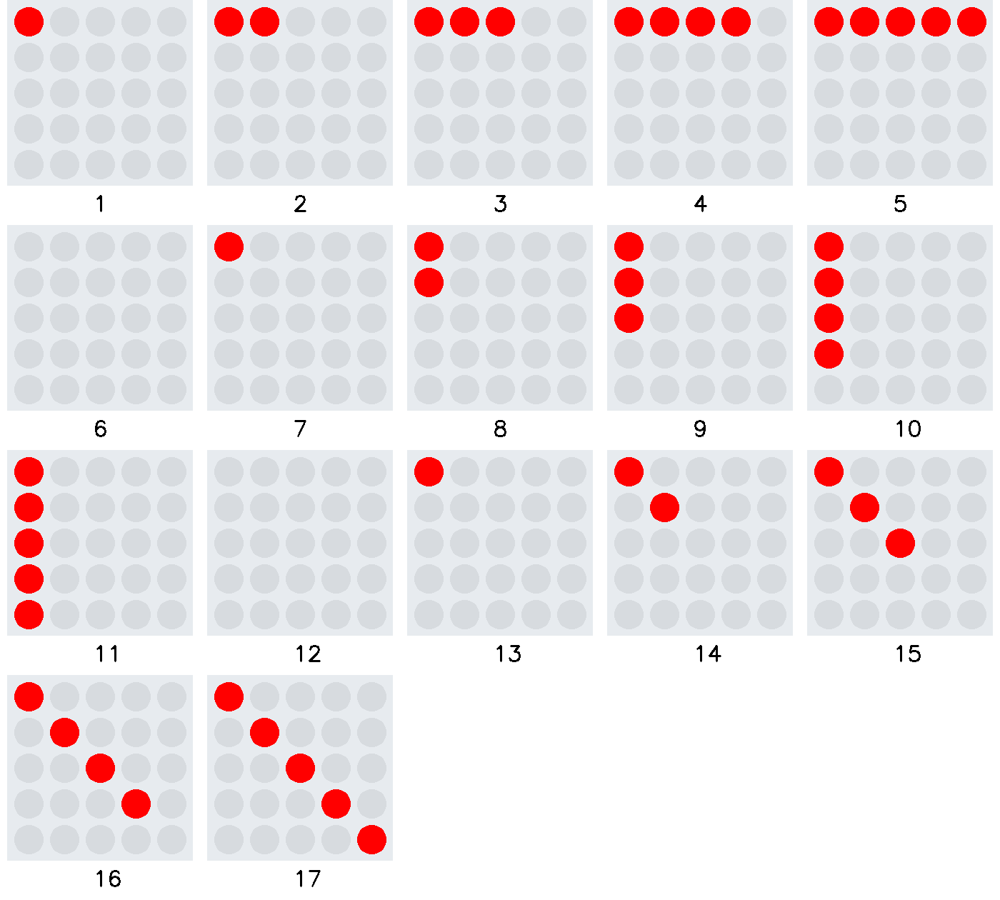
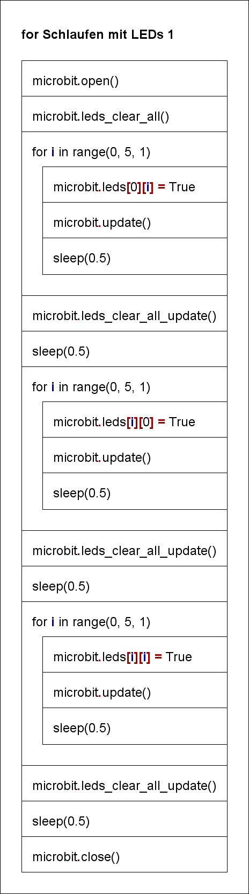

# for Schleifen mit LEDs 1

Ein grosser Vorteil des Listendatentyps besteht darin, die einzelnen Elemente über eine for Schleife anzusprechen.
```python
for i in range(0, 5, 1):
    microbit.leds[0][i] = True  # setze Leuchtdiode in Zeile 0, Spalte i
    microbit.update()  # aktualisiere den Microbit
    sleep(0.5)  # warte
```
Dies führt zu einem effizienten Zugang zu Daten, die in der Form von Listen oder Tabellen vorliegen.

## Die range Klasse

Die [range](https://docs.python.org/3.8/library/stdtypes.html?highlight=range#range) Klasse ist gut geeignet für die
Bearbeitung von Listen im Zusammenhang mit einer for Schlaufe.   
`range(start, stop, increment)`  
Bei der range Klasse ist zu beachten, dass der Bereich von `start` bis `stop`-1 mit der Schrittweite `increment`
verläuft. 
`range(0, 3 , 1)` erzeugt die Liste `[0, 1, 2]`  .
`range(4, 0 , -1)` erzeugt die Liste `[4, 3, 2, 1]`



Das Struktogramm stellt den Programmablauf grafisch dar.
  


<div class='hint'>
    <br>
</div>
