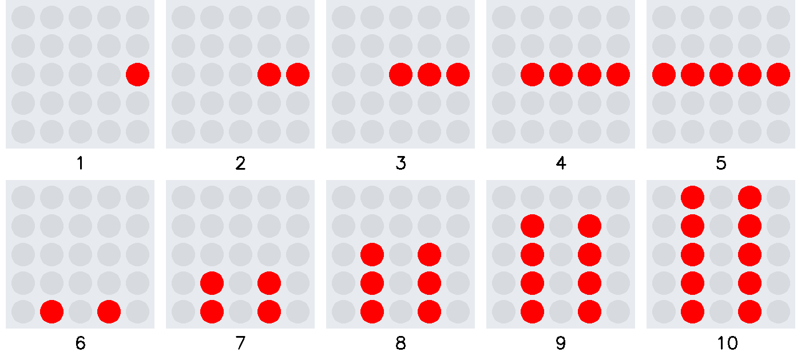
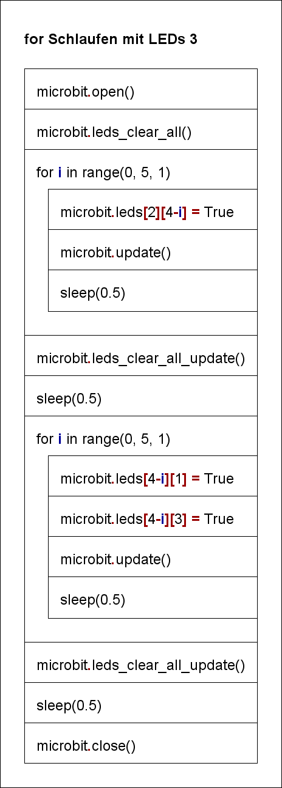

# for Schleifen mit LEDs 3

Die Indexierung der Listenindexes erlaubt mathematische Operationen.  
`microbit.leds[2][4-i] = True`
Mit dem Ausdruck `[4-i]` wird die Laufrichtung der Leuchtdioden umgedreht.

Das Struktogramm stellt den Programmablauf grafisch dar.
  

     

