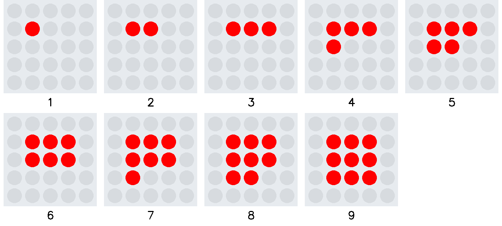
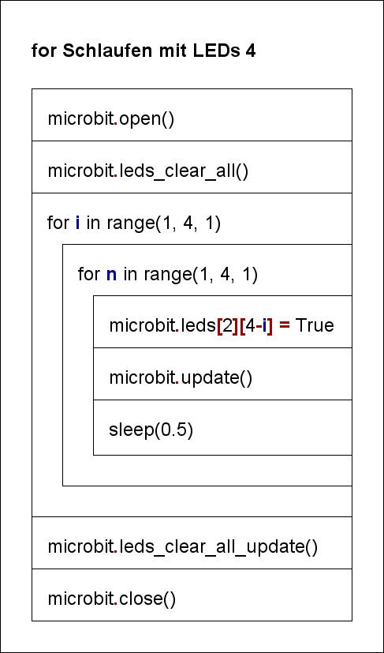
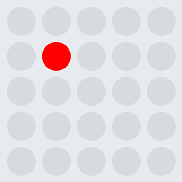

# for Schleifen mit LEDs 4

Durch Verschachtelung der beiden for Schleifen besteht die Möglichkeit
über einen Bereich der zweidimensionalen LED-Matrix zu iterieren.

Das Struktogramm stellt den Programmablauf grafisch dar.
  

     

