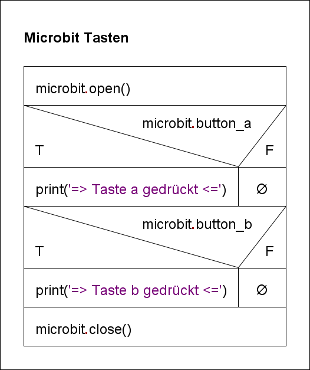
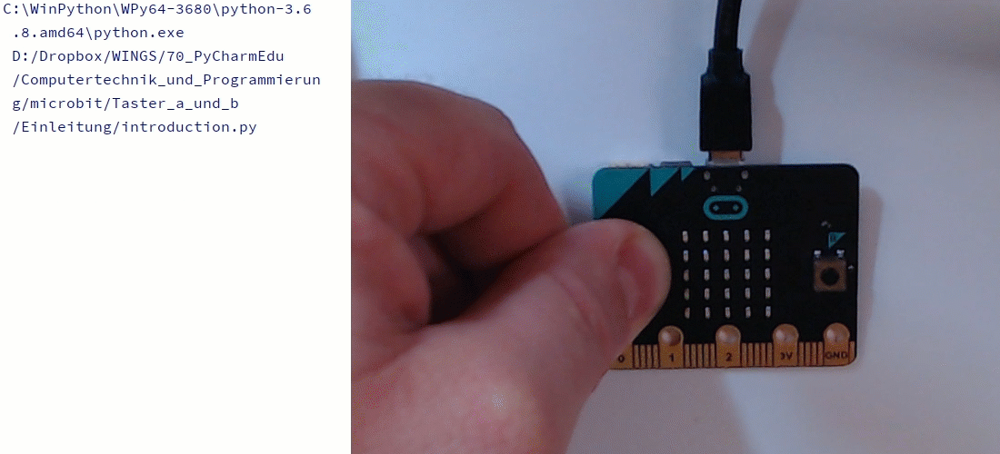

# Taster a und b: Einleitung

Der Zustand (`True` oder `False`) der zwei Tasten a und b des Microbit
wird mittels `microbit.button_a` bzw. `microbit.button_b` abgefragt. Die Abfrage, ob die Taste gedrückt wurde,
erfolgt mittels einer Verzweigung (`if`).

 

Das Struktogramm visualisiert den Algorithmus:

 

GIF-Animation 

    

