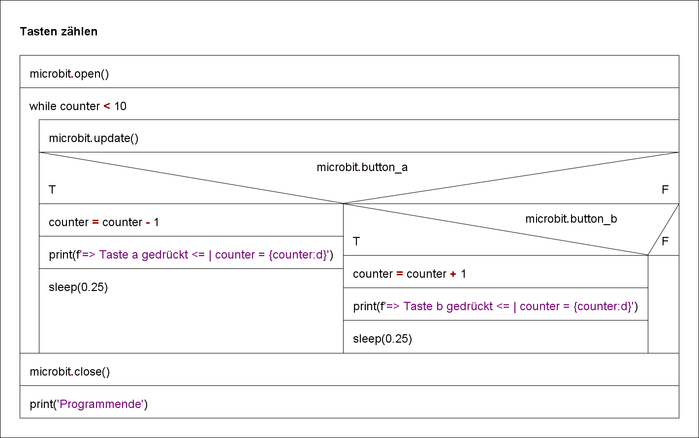

# Tasten zählen

Um die Funktionlität des Zählens von Tastendrücken umsetzen zu können, muss das Programm eine `while` Schlaufe enthalten.
Der Inhalt der `while` Schleife wird so lange ausgeführt, wie die Kopfbedingung `True` ist.

Das Struktogramm visualisiert den Algorithmus::

 

GIF-Animation 

    

