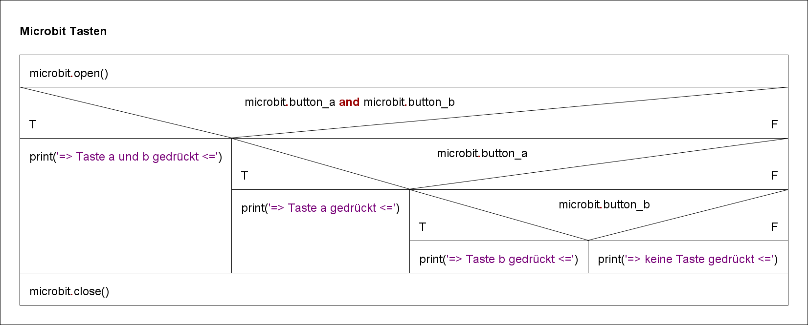

# Tastenabfrage

Bei der Betrachtung unterschiedlicher Kombinationen ist die einfache Verzweigung `if` ungeeignet.
Python benutzt bei der Mehrfachunterscheidung das `elif` Schlüsselwort.

Das Struktogramm visualisiert den Algorithmus:

 

GIF-Animation 

    

