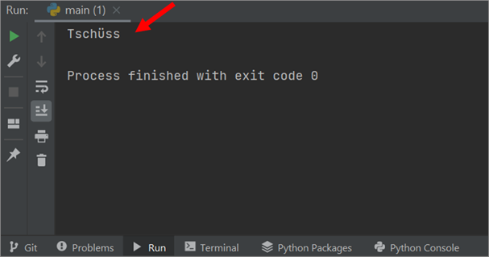
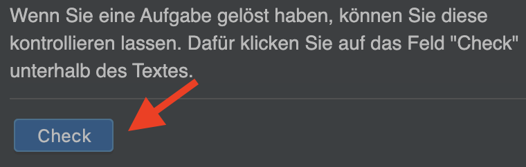

# Willkommen
Python ist eine Programmiersprache. Wie andere Sprachen auch, bietet sie uns die Möglichkeit, Ideen zu kommunizieren.
 Im Falle einer Programmiersprache sind diese Ideen "Befehle", mit denen Menschen mit einem Computer ~~kommunizieren~~ sprechen kann.
~~Wir übermitteln unsere Befehle an den Computer, indem wir sie mit einer Programmiersprache in eine Textdatei schreiben.~~
Diese Befehle werden in Textdateien, sogenannte Programmen geschrieben.
 ~~Diese Dateien werden Programme genannt.~~ Ein Programm auszuführen bedeutet, den Computer anzuweisen, die Textdatei zu
 lesen, sie in eine Reihe von Operationen zu übersetzen~~, die er versteht,~~ und diese Aktionen auszuführen.

## Programm Ausführen
Um das Programm bzw. den Code auszuführen, klicken Sie in der ersten Zeile auf den grünen Pfeil. ~~das grüne Dreieck.~~

  
Falls das Programm eine Ausgabe hat, wird diese im Terminal am unteren Rand angezeigt. 

## Aufgabe Überprüfen
~~Wenn Sie eine Aufgabe gelöst haben, können Sie diese kontrollieren lassen. Dafür klicken Sie auf das Feld "Check"
 unterhalb des Textes.~~

## Ihre erste Aufgabe

Ersetzen Sie im angezeigten Programm ~~auf der rechten Seite~~ den Text `Tschüss` durch `Willkommen` und überprüfen Sie anschliessend Ihre Lösung.
