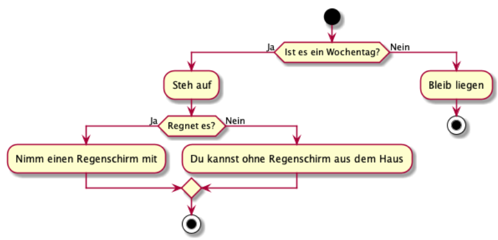

Einführung Kontrollfluss
=============

Stellen Sie sich vor, Sie wachen am Morgen auf und denken: "Ist heute ein Wochentag?"

Wenn ja, müssen Sie aufstehen, sich anziehen und sich für die Schule fertig machen (wenn Sie Glück haben ist es Donnerstag 
oder Freitag und Sie dürfen Ihr Wahlfach besuchen ;) ). Wenn nicht, können Sie noch ein bisschen länger schlafen. 
Aber leider ist es ein Wochentag, also stehen Sie auf, ziehen sich an und gehen nach draußen: "Wie ist das Wetter? 
Brauche ich einen Regenschirm?"

Diese Fragen und Entscheidungen steuern den Ablauf Ihres Morgens, jeder Schritt ist das Ergebnis der Bedingungen des 
Tages und Ihrer Umgebung. Ihr Computer durchläuft jedes Mal, wenn er einen Code ausführt, einen ähnlichen Ablauf wie Sie. 
Ein Programm wird gestartet (wacht auf) und beginnt, seine Checklisten durchzugehen: Ist diese Bedingung erfüllt, 
ist jene Bedingung erfüllt, okay, führen wir diesen Code aus und geben diesen Wert zurück.

Dies nennt man den **Kontrollfluss** eines Programms. In Python wird Ihr Skript von oben nach unten ausgeführt, bis es 
nichts mehr auszuführen gibt. Es ist Ihre Aufgabe **Bedingungen**, einzufügen, um dem Computer mitzuteilen, wann 
er bestimmte Codeblöcke ausführen soll. Wenn diese Bedingungen erfüllt sind, führen Sie diese Funktion aus.

Im Laufe dieser Lektion werden Sie lernen was Booleans sind, wie man sie zur Überprüfung von Bedingungen benutzt und
wie Sie Bedingungen in Python erstellen.


<!---
```puml
start
if (Ist es ein Wochentag?) then (Ja)
    :Steh auf;
    if (Regnet es?) then (Ja)
        :Nimm einen Regenschirm mit;
    else (Nein)
        :Du kannst ohne Regenschirm aus dem Haus;
    endif
    stop
else (Nein)
    :Bleib liegen;
    stop
endif
```
-->

