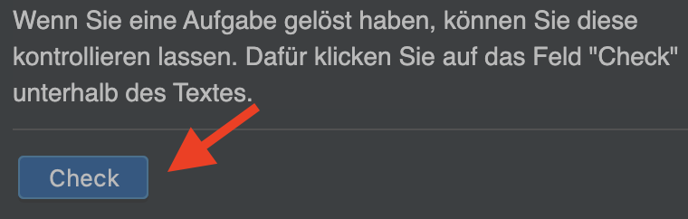

# Willkommen

Python ist eine Programmiersprache. Wie andere Sprachen auch, bietet sie uns die Möglichkeit, Ideen zu kommunizieren.
 Im Falle einer Programmiersprache sind diese Ideen "Befehle", mit denen Menschen mit einem Computer kommunizieren.

Wir übermitteln unsere Befehle an den Computer, indem wir sie mit einer Programmiersprache in eine Textdatei schreiben.
 Diese Dateien werden Programme genannt. Ein Programm auszuführen bedeutet, den Computer anzuweisen, die Textdatei zu
 lesen, sie in eine Reihe von Operationen zu übersetzen, die er versteht, und diese Aktionen auszuführen.

## Code Ausführen

Um ihren Code auszuführen, klicken Sie in der ersten Zeile auf das grüne Dreieck.

  

## Aufgabe Überprüfen

Wenn Sie eine Aufgabe gelöst haben, können Sie diese kontrollieren lassen. Dafür klicken Sie auf das Feld "Check"
 unterhalb des Textes.

  

## Aufgabe

Ersetzen Sie im Programm auf der rechten Seite den Text `Tschüss` durch `Willkommen`.